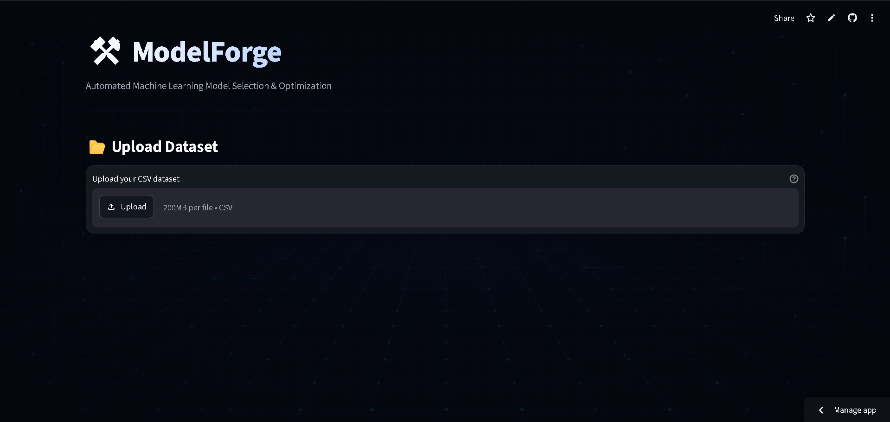

# ⚡ ModelForge

**A Machine Learning Model Selection & Hyperparameter Tuning Platform**

ModelForge is an interactive Streamlit application that lets you upload a dataset, explore it, train multiple machine learning models side by side, compare their performance, and automatically find the best-tuned model — all without writing a single line of code.

[](https://modelforge-kv96.streamlit.app/)
[](https://www.python.org/)
[](#-license)



---

## 🚀 Live Demo

👉 **[modelforge-kv96.streamlit.app](https://modelforge-kv96.streamlit.app/)**

---

## 📖 Table of Contents

- [Features](#-features)
- [Supported Models](#-supported-models)
- [Tech Stack](#️-tech-stack)
- [Workflow](#-workflow)
- [Project Structure](#-project-structure)
- [Getting Started](#-getting-started)
- [Usage](#-usage)
- [Future Improvements](#-future-improvements)
- [Contributing](#-contributing)
- [License](#-license)
- [Author](#-author)

---

## ✨ Features

- 📂 **Upload CSV datasets** directly from your browser
- 🔍 **Dataset overview & analysis** — shape, types, missing values, and summary stats
- 🤖 **Classification & Regression support** — pick the task that fits your data
- 📊 **Model performance comparison** across multiple algorithms at once
- ⚙️ **Hyperparameter tuning** using `RandomizedSearchCV`
- 🏆 **Best model recommendation** based on evaluation metrics
- 📈 **Performance metrics & visualizations** to interpret results at a glance

---

## 🤖 Supported Models

### Classification
- Logistic Regression
- K-Nearest Neighbors (KNN)
- Decision Tree
- Random Forest
- Support Vector Machine (SVM)
- Naive Bayes
- Gradient Boosting

### Regression
- Linear Regression
- Decision Tree Regressor
- Random Forest Regressor
- Support Vector Regressor (SVR)

---

## 🛠️ Tech Stack

| Category | Tools |
|---|---|
| Language | Python |
| Web App / UI | Streamlit |
| Data Handling | Pandas, NumPy |
| Machine Learning | Scikit-learn |
| Visualization | Plotly |

---

## 🔄 Workflow

```
Upload Dataset → Data Analysis → Select ML Task → Train Multiple Models
        → Compare Performance → Hyperparameter Tuning → 🏆 Best Model
```

---

## 📁 Project Structure

```
ModelForge/
├── app.py                # Streamlit app entry point / UI logic
├── model_registry.py     # Registry of available ML models
├── preprocessing.py       # Data cleaning & preprocessing pipeline
├── trainer.py             # Model training logic
├── tuner.py                # Hyperparameter tuning (RandomizedSearchCV)
├── requirements.txt       # Project dependencies
└── ModelForge.png         # App banner / screenshot
```

---

## 💻 Getting Started

### Prerequisites
- Python 3.9 or higher
- pip

### Installation

1. **Clone the repository**
   ```bash
   git clone https://github.com/KoushalVaswani/ModelForge.git
   cd ModelForge
   ```

2. **Create a virtual environment** (recommended)
   ```bash
   python -m venv venv
   source venv/bin/activate      # On Windows: venv\Scripts\activate
   ```

3. **Install dependencies**
   ```bash
   pip install -r requirements.txt
   ```

4. **Run the app**
   ```bash
   streamlit run app.py
   ```

5. Open your browser at `http://localhost:8501` 🎉

---

## 🧭 Usage

1. Launch the app and **upload a CSV dataset**.
2. Review the **automatic dataset overview** (shape, column types, missing values, stats).
3. Choose whether your problem is **classification** or **regression**.
4. Let ModelForge **train and compare** all supported models for that task.
5. Review the **performance comparison table/charts** to see how each model did.
6. Run **hyperparameter tuning** to squeeze out extra performance.
7. Get the **best model recommendation** with its optimized parameters.

---

## 🔮 Future Improvements

- [ ] Automatic preprocessing (encoding, scaling, imputation)
- [ ] Feature engineering tools
- [ ] More ML algorithms (XGBoost, LightGBM, etc.)
- [ ] Feature importance visualization
- [ ] Model download/export (`.pkl`)
- [ ] Automated ML reports (PDF/HTML)

---

## 🤝 Contributing

Contributions, issues, and feature requests are welcome!

1. Fork the project
2. Create your feature branch (`git checkout -b feature/AmazingFeature`)
3. Commit your changes (`git commit -m 'Add some AmazingFeature'`)
4. Push to the branch (`git push origin feature/AmazingFeature`)
5. Open a Pull Request

Feel free to check the [issues page](https://github.com/KoushalVaswani/ModelForge/issues) if you want to contribute.

---

## 📄 License

This project is licensed under the MIT License — feel free to use, modify, and distribute it.
*(Add a `LICENSE` file to the repo to make this official.)*

---

## 👨‍💻 Author

### Koushal Vaswani

🎓 Artificial Intelligence & Machine Learning Student
🤖 Passionate about Machine Learning & AI
💻 Building practical ML projects and exploring real-world applications

🔗 **GitHub:** [@KoushalVaswani](https://github.com/KoushalVaswani)

---

⭐ If you found **ModelForge** useful, consider giving the repository a star — it really helps!
